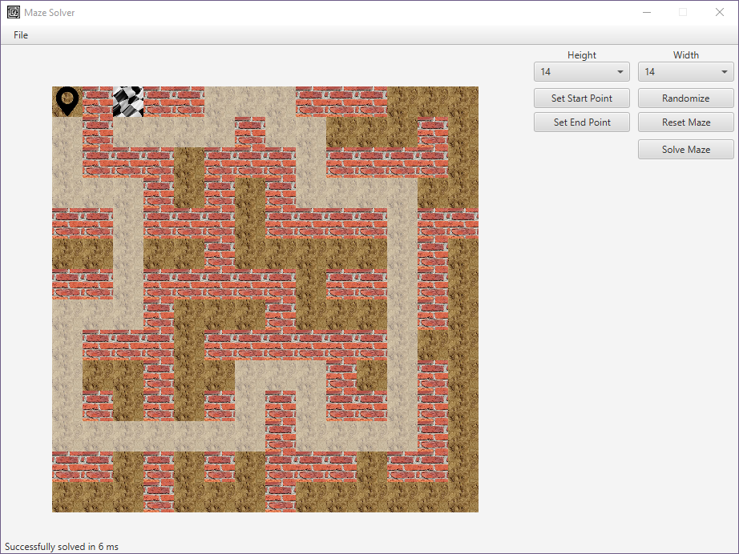

# Maze Solver

Simple maze solver built using JavaFX. The app uses the A* (A-star) algorithm.

## Screenshots

## Key Features

* Enter your maze to the app
* Solve the maze easily and efficiently with the A-star algorithm
* Save and load maze files
* Generate random mazes (although solvability is not guaranteed)

## Built With

* [JavaFX](https://openjfx.io/) - GUI application platform
* [Maven](https://maven.apache.org/) - Dependency management
* [JUnit](https://junit.org/junit5/) - Unit test framework

***
> _The third term coursework._